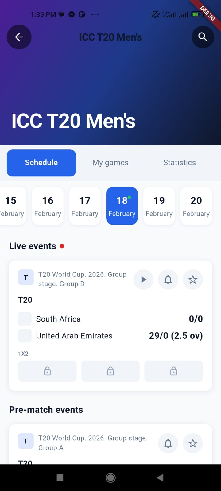
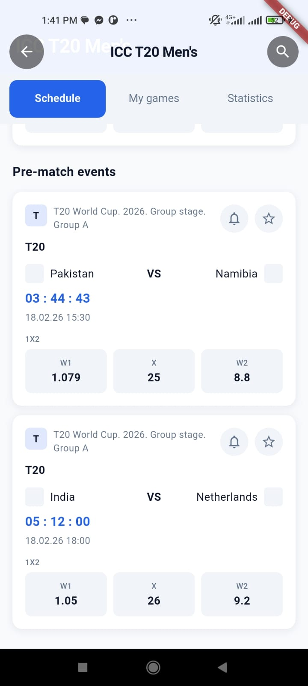
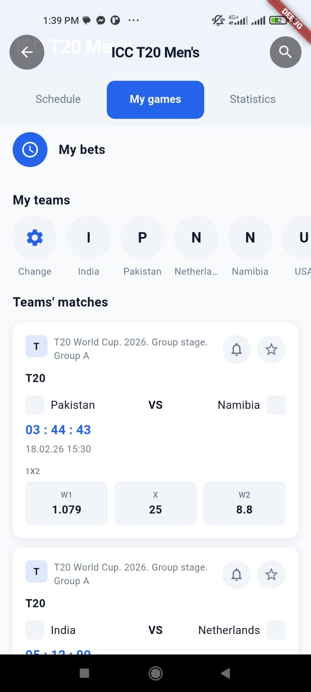
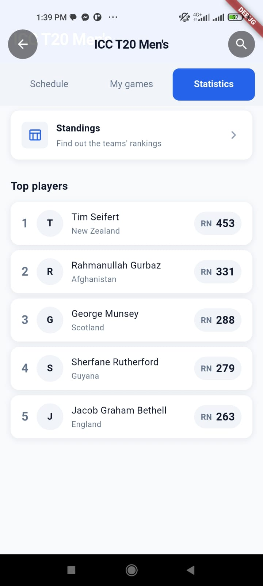

# ICC T20 Men's – Complex UI Reconstruction

This project is a Flutter implementation of an **ICC T20 Men's** tournament screen, focused on **pixel-perfect reconstruction** of a complex betting/fixtures UI from design mocks.  
The app demonstrates:
- A collapsing hero header with sticky title and tab bar.
- A tabbed interface (`Schedule`, `My games`, `Statistics`) with rich, scrollable content.
- Smooth in-tab navigation (calendar strip, carousels, expandable cards).
- Responsive layouts and overflow-safe components across device sizes.

---

## 1. Technical Stack

- **Framework**
  - Flutter (Material 3)
- **State Management**
  - `flutter_bloc` – BLoC pattern for:
    - `ScheduleBloc`
    - `MyGamesBloc`
    - `StatisticsBloc`
  - `equatable` – value equality for entities and Bloc state.
- **Networking / Data**
  - `http` (planned) – intended for future real API integration (current app uses mock repositories).

---

## 2. Project Structure & Architectural Approach

The app follows a **layered architecture** with a clear separation between **presentation (UI)**, **domain (business rules)**, and **data (repositories)**. It uses the **BLoC pattern** for all stateful screens.

High-level structure:

- `lib/core/`
  - `theme/` – colors, typography, radii, and `AppTheme`.
  - `widgets/` – shared, reusable building blocks (cards, section headers, icon buttons, odds row, team row).
- `lib/features/icc_t20_screen/`
  - Main entry screen: collapsing header + tab bar + `TabBarView`.
- `lib/features/schedule/`
  - `data/` – `MockScheduleRepository`.
  - `domain/` – entities (`LiveEventEntity`, `PreMatchEventEntity`, `ResultEventEntity`, `ScheduleData`), `ScheduleRepository`, `GetScheduleForDateUseCase`.
  - `presentation/`
    - `bloc/` – `ScheduleBloc`, `ScheduleEvent`, `ScheduleState`.
    - `widgets/` – calendar strip, live/pre‑match/result cards.
    - `schedule_page.dart` – composes the **Schedule** tab as a sliver-based scroll.
- `lib/features/my_games/`
  - `data/` – `MockMyGamesRepository`.
  - `domain/` – entities (`MyTeamEntity`, `TeamMatchEntity`, `MyGamesData`), `MyGamesRepository`, `GetMyGamesUseCase`.
  - `presentation/`
    - `bloc/` – `MyGamesBloc`, `MyGamesEvent`, `MyGamesState`.
    - `widgets/` – `MyBetsRow`, `MyTeamsCarousel`.
    - `my_games_page.dart` – composes the **My games** tab (My bets, My teams, Teams’ matches).
- `lib/features/statistics/`
  - `data/` – `MockStatisticsRepository`.
  - `domain/` – entities (`StandingsEntryEntity`, `TopPlayerEntity`, `StatisticsData`), `StatisticsRepository`, `GetStatisticsUseCase`.
  - `presentation/`
    - `bloc/` – `StatisticsBloc`, `StatisticsEvent`, `StatisticsState`.
    - `widgets/` – `StandingsCard`, `TopPlayerListItem`.
    - `statistics_page.dart` – composes the **Statistics** tab with standings + top players.

**Main BLoCs and responsibilities:**

- `ScheduleBloc`
  - Manages calendar dates, selected date, and lists of live, pre‑match, and result events.
  - Drives the `ScheduleCalendarStrip` and all schedule cards from mock repository data.
- `MyGamesBloc`
  - Manages selected “my teams” and the associated “teams’ matches”.
  - Powers the My Teams carousel and Teams’ matches list.
- `StatisticsBloc`
  - Provides standings and top players data for the Statistics tab.

---

## 3. Generative AI Usage


---

## 4. How to Run

1. **Clone the repository**
   ```bash
   git clone <your-repo-url>.git
   cd flutter_complex_ui_guide
   ```

2. **Install Flutter dependencies**
   ```bash
   flutter pub get
   ```

3. **Run on a connected device or emulator**
   ```bash
   flutter run
   ```

4. **Open the ICC T20 UI**
   - The app’s `home` in `lib/main.dart` is already set to `IccT20Screen`, which shows:
     - Collapsing ICC T20 header with back/search.
     - Tab bar for **Schedule**, **My games**, **Statistics**.

---

## 5. Screenshots

- **Schedule – Live & Pre‑match**
  - 

- **Schedule – Pre‑match list**
  - 

- **My games – My bets, My teams, Teams’ matches**
  - 

- **Statistics – Standings & Top players**
  - 

